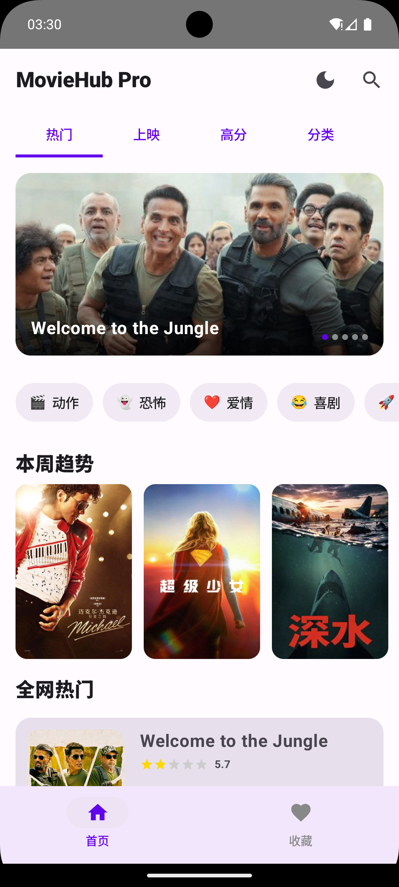
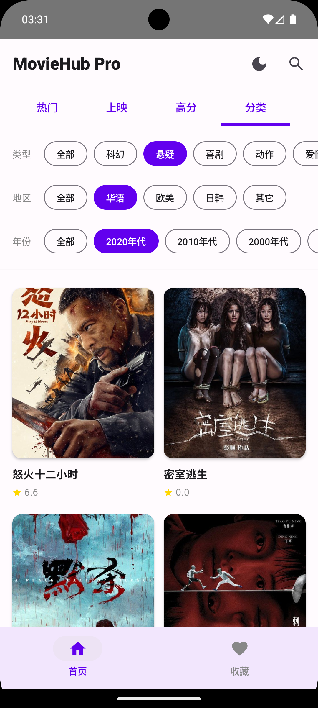
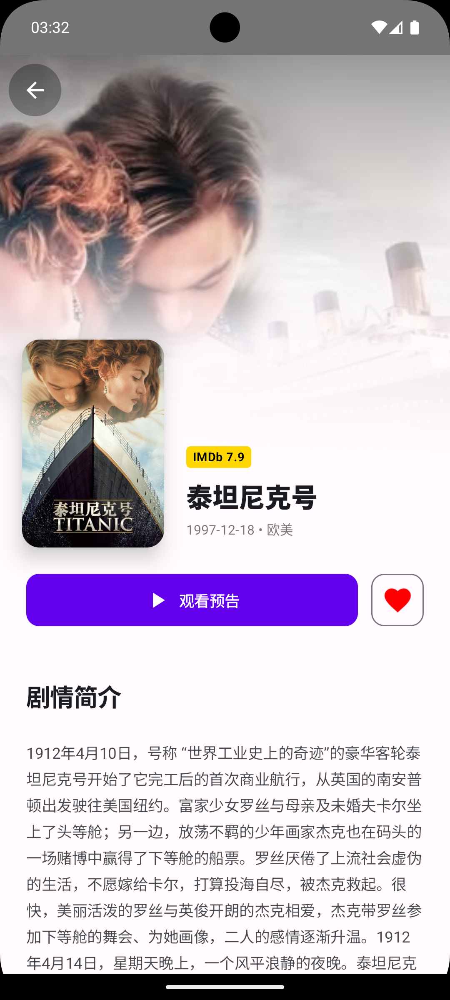
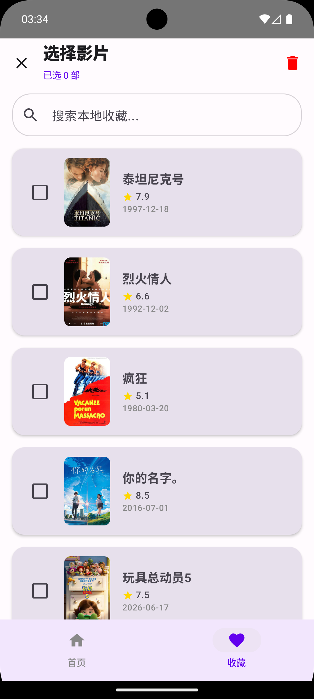
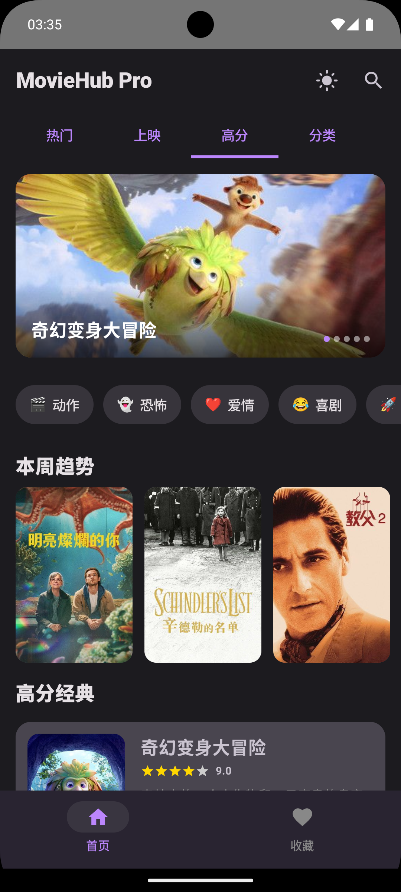
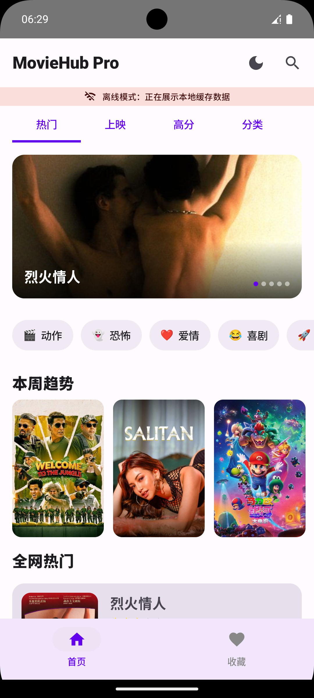
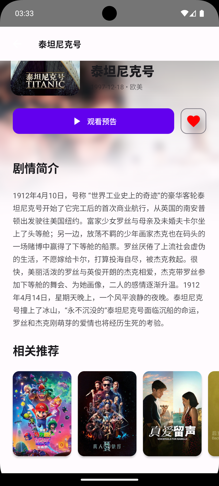
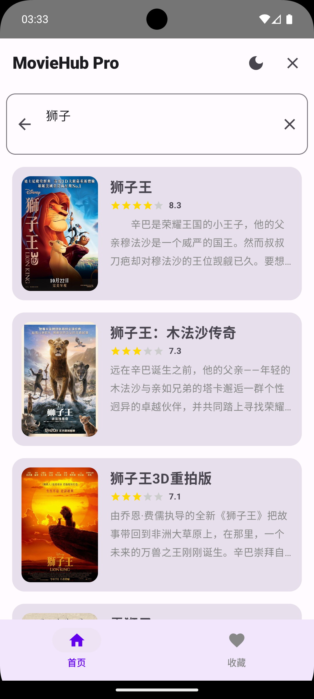

# 2025003022-FinalProject
MovieHubPro 电影资讯App —— 移动端软件开发期末大作业

MovieHubPro 是一款基于 Jetpack Compose 现代技术栈构建的沉浸式电影资讯 App。本项目作为移动端软件开发课程的期末大作业，不仅实现了完整的数据增删改查（CRUD）逻辑，更深度集成了全球最大的电影数据库 TMDB API，提供了服务端级别的多维筛选、分页加载、离线缓存以及高效的收藏管理功能。

🌟 核心亮点 (Key Features)
1. 首页：商业级多维动态布局
• Hero Banner：沉浸式巨幕轮播，展示全网最热影片，带自动渐变遮罩。
• 本周趋势：横向滚动推荐，利用阴影和层级营造呼吸感。
• 快捷分类：内置 8 种高频电影类别（动作、科幻、动画等），一键触达目标。
• 无限分页：所有列表均支持滑到底部自动加载下一页数据，体验丝滑。

2. 详情页：沉浸式视觉体验
• Edge-to-Edge：背景大图直接穿透至系统状态栏，极具视觉冲击力。
• 交互闭环：支持查看剧情简介（自适应展开）、查看相似电影推荐。

3. 分类频道：全库级别筛选
• 服务端驱动：对接 Discover API，支持“类型 + 地区 + 年份”三位一体的交叉实时过滤。
• 精准匹配：实现了原始语言代码到中文标签（华语、欧美、日韩等）的深度映射。

4. 收藏库：高效管理模式
• 批量管理：特有“管理模式”，支持勾选多部影片一键批量取消收藏。
• 本地检索：支持对收藏内容的模糊搜索与年份筛选，响应速度达毫秒级。

5. 架构与性能：离线优先
• 三级缓存：网络 -> Room 数据库 -> StateFlow 内存，确保无网状态下 App 依然“有内容可看”。
• 网络监听：实时检测网络连接，断网时自动显示离线 Banner 提示。
• 极致优化：支持图片 Crossfade 淡入、搜索请求 400ms 防抖、分页去重保护。

🛠 技术栈 (Tech Stack)
| 维度 | 技术选型 |
| ---- | ---- |
| 开发语言 | Kotlin |
| UI 框架 | Jetpack Compose (100% 无XML布局) |
| 视觉规范 | Material Design 3 (M3) |
| 架构模式 | MVVM + Repository + 单向数据流UDF |
| 网络请求 | Retrofit 2 + OkHttp 4 |
| 数据持久化 | Room（双数据表）+ DataStore (偏好存储) |
| 异步处理 | Kotlin Coroutines + Flow / StateFlow |
| 依赖注入 | AppContainer 手动依赖注入 |
| 图片加载 | Coil 图片异步加载 |

📂 项目结构 (Project Structure)
```
app/src/main/java/com/example/moviehubpro/
├── data/
│   ├── api/            # Retrofit 接口、网络DTO实体
│   ├── db/             # Room数据库、Entity、DAO
│   ├── repository/     # 数据仓库，统一协调网络与本地数据库
│   └── datastore/      # 主题偏好、搜索历史持久化
├── model/              # 业务领域模型
├── ui/
│   ├── screen/         # 首页、分类、收藏、详情页面
│   ├── screen/viewmodel # 各页面独立ViewModel
│   ├── components/    # 通用复用UI组件（骨架屏、错误页、搜索栏等）
│   └── theme/         # M3深浅色主题配置
├── navigation/         # Compose导航路由管理
├── util/               # 工具类、网络状态监听、常量
└── MainActivity.kt     # 应用入口、全局导航容器
```

## ⚙️ 配置与构建
### 1. 下载项目
```shell
git clone https://github.com/starry0616/2025003022-FinalProject.git
cd 2025003022-FinalProject
```

### 2. 配置 Android SDK
项目根目录新建/修改 `local.properties`，填入本机SDK路径：
#### Windows
```properties
sdk.dir=C:\\Users\\您的用户名\\AppData\\Local\\Android\\Sdk
```
#### macOS
```properties
sdk.dir=/Users/您的用户名/Library/Android/sdk
```

### 3. 配置 TMDB API Key
项目内置演示密钥，无需修改即可运行；如需替换，修改常量文件：
```kotlin
// com.example.moviehubpro.util.Constants.kt
const val API_KEY = "您的_TMDB_API_KEY"
```
> 无有效Key时自动加载本地Mock模拟数据，完整功能可正常演示

---

# 🚀 运行项目
## 方式1：Android Studio 可视化运行
1. Android Studio Jellyfish 及以上版本打开项目根目录
2. Gradle 设置中将JDK版本切换为 **JDK 17**
3. 等待依赖同步完成
4. 连接模拟器/真机，点击 `Run 'app'` 编译安装

## 方式2：命令行打包构建
### Windows
```cmd
gradlew.bat assembleDebug
```
### macOS / Linux
```bash
./gradlew assembleDebug
```
打包后Debug APK路径：`app/build/outputs/apk/debug/app-debug.apk`

---

# 🔍 Room 本地数据库查看
App启动后可查看缓存、收藏数据表：
1. 顶部菜单 `View` → `Tool Windows` → `App Inspection`
2. 切换至 `Database Inspector`，选中当前应用进程
3. 常用查询SQL示例
```sql
-- 查询所有华语收藏影片
SELECT * FROM favorite_movies WHERE originalLanguage = 'zh';
-- 按评分降序查看本地缓存影片
SELECT * FROM movie_cache ORDER BY voteAverage DESC;
```

##📷 运行截图说明
## 1. 首页页面


## 2. 分类筛选页面


## 3. 电影详情页


## 4. 收藏管理页面


## 5. 深色模式效果


## 6. 离线无网提示页面


## 7. 影片搜索页面




📄 许可声明
本项目仅供移动端软件开发课程期末作业学术评估使用，影片数据版权归 TMDB 官方所有，禁止商用。

学号：2025003022
提交日期：2026-06-29
